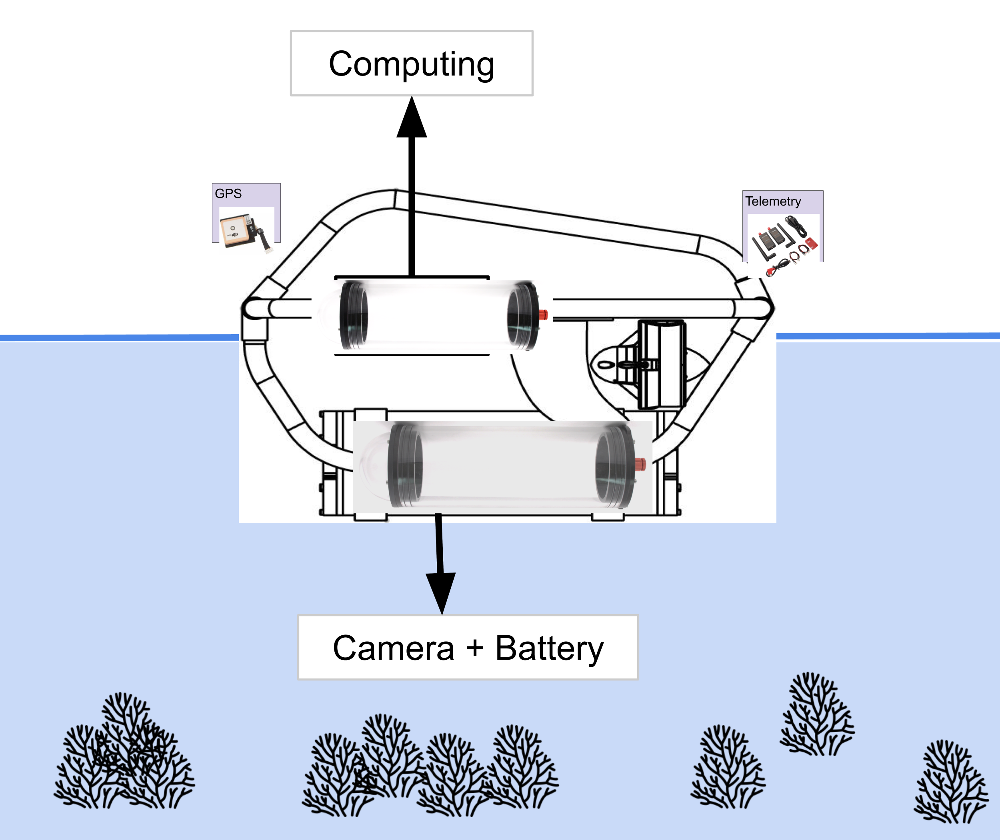

# Description
This folder contains the specifications of the Drone's mechanical layout.

# New assembly
We are considering a new assembly of the drone, looking like this:

# Future updates
* New fixing point for the propellers
* Better buoyancy at the back

# Half-Circle Shape
Inspired by a bow and arrow shape, we consider the half circle shape. Here is the illustration of the shape.

By using a flexible pole and some rope for the camera support, the overall prototype looks like this.

## Videos
We have also uploaded the testing video in YouTube, where people can easily get access to it. Here is the video.

## Good things

## Things to Improve

# Full-Circle Shape
As a continuation of the last version progress, we consider to double the shape into the full-circle shape. Here is the illustration of the shape.

By using the same technique from the last prototype, the overall prototype looks like this.

## Videos
We have also uploaded the testing video in YouTube, where people can easily get access to it. Here is the video.

## Good things

## Things to Improve

# Triangle Shape
Our next prototype is having a triangle shape, where the brain is located at the middle and two propellers in the left and right boat. Here is the illustration of the shape.

## Videos
We have also uploaded the testing video in YouTube, where people can easily get access to it. Here is the video.

## Good things
* Smooth acceleration and deacceleration
* Smaller radius needed when it has to turn 360 degree

## Things to Improve
* The shape will be hard to carry if the size increases
* The shape still has a lot of flexibility, which can be unacceptable when the bigger waves coming

# Ladder Shape
To further simplify the triangle shape, we consider the ladder shape. Here is the illustration of the shape.

By using an alumunium pipe, we create a collapsable ladder shape, the overall prototype looks like this.

## Videos
We have also uploaded the testing video in YouTube, where people can easily get access to it. Here is the video.

## Good things
* Simpler shape than last prototype
* Similar package size with the last triangle shape after the width increase to 5 metres

## Things to Improve
* Connection need to be stronger, one of the propeller didn't work
* Need to further reduce the size

# Scissor Shape
After the last test, we need some shape that even more collapsable. This inspiration comes from scissor mechanics and we decide to illustrate it with wooden stick. Here is the illustration of the shape.

By using an alumunium pipe, we create a collapsable scissor shape. The boat is once again made of styrofoam and wood. However, this time we decide to use a thicker wood. The overall prototype looks like this.

Before we did the final test, we had a test in the local beach to make sure every components is working fine.

# Videos
Here are some videos from the Hoi Ha Wan Final test.

## Good things
* Significantly more compact structure
* Boat is uniformly manufactured
* Visibility is good
* Batteries lasted great for thrusters and cameras
* Two or three prototype away from minimum viable product

## Things to Improve
* Weight of the boat
* Might want to look for different materials option
* Scissors consider to be too flexible
* Nuts and bolts are falling off, might want to search for connectors alternatives
* Waterproofing technique
