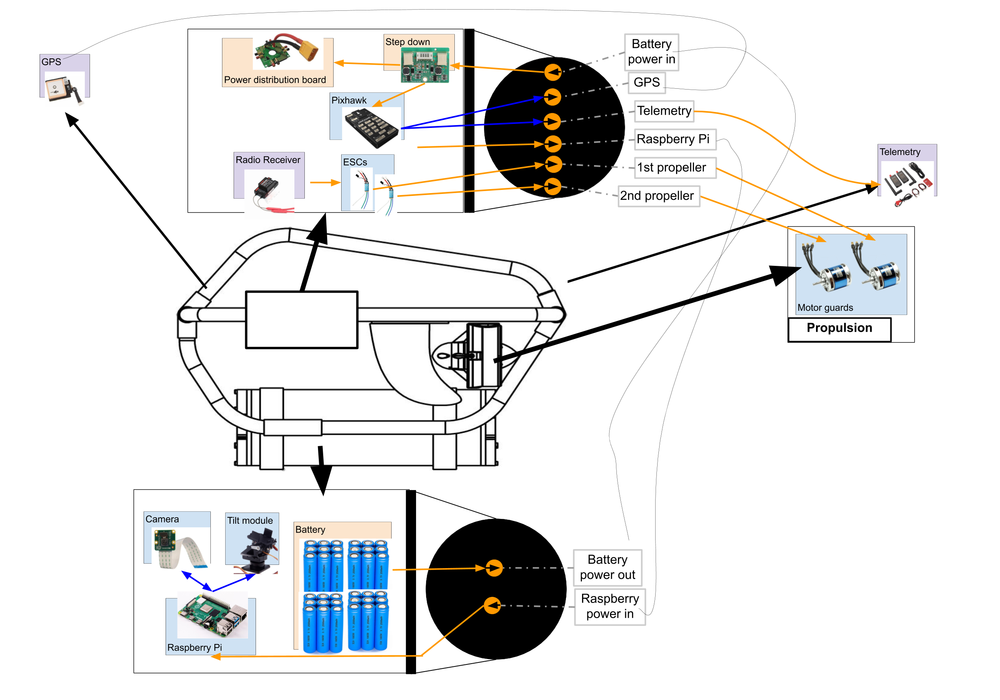
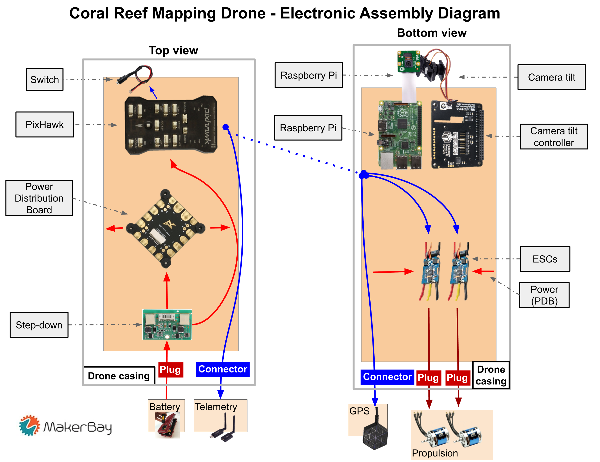

# Description
This folder contains the specifications of the Drone's electronic  & electrical hardware.
We chose to present the electrical assembly as a diagram, in order to facilitate understanding. A PDF file with annotated pictures is also available in this folder.
# v2.0
# New assembly
We working on a new assembly, allowing to put batteries in the bottom, for a more stable drone. Here's what it looks like

# Electronic assembly diagram
This diagram shows the current version of the electronic assembly of the 'brain casing'. The Raspberry Pi, the camera and the camera tilt control are not connected to the rest of the drone yet. This assembly shows their final position, but doesn't show the cabling. This drone doesn't have any camera function yet, it can simply be seen as an RC boat for now. 

# Diagram of main functions
This diagram shows the main function of the drone, with the 

# Video of Electrical Assembly

# Future updates
* List of components
* Assembly instructions
* Integration of the Raspberry Pi, the tilt controller and the camera

# 'Scissors' version 
Following part describes how electronic and electrical asembly was designed for the last version 'Scissors'. Both photos from the final product and its schematic drawings can be found to facilitate understanding. This part doesn't include Raspberry Pi and camera tilt. 

# From single camera to multiple 
As more insight was brought to the project, it was concluded to use 5 cameras instead of just 1. Hence, instead of using Raspbryy camera, in this design we use 5 GoPro cameras located at the bottom of each boat which are not connected to Raspberry Pi and the whole system in general. 

# Assembly diagram 
The diagrams show how the electronic components were allocated on the boats. The diagram only shows components placement without pin numbers or wirings. 

 

# Connection diagram 
The diagram shows the connections to be made between components to make everything functionable. It includes all the components that we have used in this version 

# Radio controller
Controller has 4 arms at the top that need to be set properly to be able to control the thrusters. 
Bottom left: down - unarmed (not ready to use)
              up - armed (ready to use) 
Top right: down - manual mode 
           middle - loiter mode (stay in one place) 
           up - auto mode (start waypoint mission) 
Other two do not affect anything

 

# Further improvements
1. More neat and efficient wiring - use waterproof connectors that can be opened/closed easily 
2. Add and connect telemetry
3. Add component specifications

